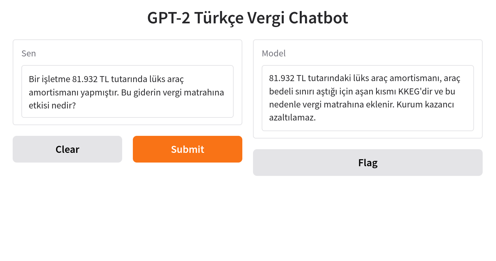
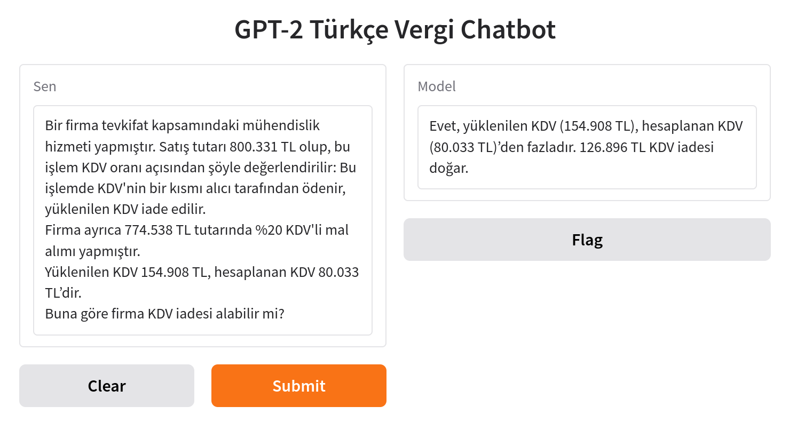

# Türkçe Vergi LLM Projesi (GPT-2 Tabanlı)

Bu proje, Türkçe dilinde vergi, mali mevzuat ve sayısal içerikler üzerine uzmanlaşmış küçük boyutlu bir dil modeli (LLM) geliştirmeyi hedefler. GPT-2 mimarisi temel alınmış ve model sıfırdan Türkçe verilerle eğitilmiştir.

## Proje Özeti

- Model: GPT-2 Small (Türkçe tokenizer ile, sıfırdan eğitildi)
- Eğitim Yaklaşımı:
  - Pretraining: Türkçe Wikipedia, sözlük ve diyalog verileriyle sıfırdan genel dil eğitimi
  - Fine-tuning: Vergi, mali mevzuat, sayısal ve senaryo tabanlı verilerle özel alan uyarlaması
- Veri:
  - 2.000+ vergi QA çifti  
  - 36.000 sayısal/senaryo tabanlı örnek  
  - 500 satırlık özel hazırlanmış diyalog seti
- Eğitim Özellikleri:
  - Chain (zincirleme) fine-tune sistemi
  - Schedule tabanlı part bazlı otomasyon
  - Sliding window ve bağlam koruma stratejisi
  - Maksimum çıktı uzunluğu: Model 512 token blok boyutuyla eğitildiği için yaklaşık 512 token'a kadar çıktı üretebilmektedir.
- Başarı Oranı: QA setinde yaklaşık %80 doğruluk
- Sistem: Pop!_OS 22.04, 24GB RAM, GTX 1050 GPU

## Proje Amacı ve Motivasyon

Bu proje, yalnızca hazır bir model üzerine veri vermekten öteye geçerek, Türkçe bir dil modeli oluşturma sürecini en alt katmandan ele alma amacını taşır. Vergi, mevzuat, muhasebe ve hesaplama gibi kurallı ve bağlamsal alanlarda çalışan modellerin daha güvenilir yanıtlar vermesi için özel olarak yapılandırılmıştır.

Modelin tasarımı, sadece doğal dil üretimi değil, aynı zamanda analitik ve işlem tabanlı düşünme yetkinliği kazandırmayı hedefler.

## Demo ve Test Süreci

Model çıktıları, hem klasik inference betikleriyle hem de Gradio tabanlı yerel bir arayüzle test edilmiştir. Girdi-çıktı analizleri, prompt değerlendirmeleri ve kullanıcı etkileşim senaryoları bu testler sırasında gerçekleştirilmiştir. Özellikle sayısal hesaplama, senaryo takibi ve bağlamı koruma gibi alanlarda Gradio arayüzü hızlı geri bildirim sağlamıştır.

### Küçük Veri Stratejisi ve Sayısal Sınırlamalar

Model, küçük ama odaklı bir veri kümesi ile eğitildi:
- 2.000 satır vergi ve mevzuat QA
- 36.000 satır sayısal hesaplama senaryosu
- 500 satır diyalog örneği

Amaç, sınırlı kaynakla **bağlamı doğru kuran**, doğal ama kontrollü yanıtlar veren bir temel model üretmekti. Sayı içeren örneklerde bazı hesap hataları görülebilir — bu bilinçli bir tercihtir.

**Neden bu yol seçildi?**
1. *Gözlemleme*: Modelin neyi öğrendiğini ve neyi yanlış yaptığı net biçimde izlemek
2. *Hedefli veri artırımı*: Her gözlemlenen hataya karşılık gelen veri ihtiyacını planlayarak ilerlemek
3. *Rakamları hesaplama katmanına taşımak*: Calculator / API / RAG entegrasyonu ile sayısal doğruluğu dışarıda yönetmek

### Genelleme Yeteneği ve Tasarım Tercihi

Model, küçük ama odaklı veri setiyle eğitildiği için, eğitilen örüntüler dışında kalan bazı soru tiplerinde genelleme yeteneği sınırlı olabilir. Bu, bilinçli bir tercih olup, modelin öğrenme sınırlarını gözlemleyerek hangi veri türünün neyi iyileştirdiğini test etmeye olanak sağlamaktadır.

Genelleme kabiliyeti, ilerleyen versiyonlarda:
- Örnek çeşitliliği artırılarak
- Diyalog ve senaryo temelli verilerle desteklenerek
- Bağlamlı metin parçalama (sliding window) teknikleriyle geliştirilecektir.


## Modelden Örnek Yanıtlar – Güçlü ve Geliştirmeye Açık Yönler

Model, bağlamı doğru kurma, mevzuat dilini öğrenme ve teknik sorulara sözel cevap verme konusunda oldukça başarılıdır. Ancak sayısal hesaplamalar gibi görevlerde, hesap motoru bulunmadığı için tutarsızlıklar gözlemlenmiştir.

Aşağıda bir doğru örnek ve bir sınırlı örnek yer almaktadır:

---

### Örnek 1 – Lüks Araç Amortismanı ve KKEG Uygulaması



> Bu örnekte model, lüks araç amortismanı ile ilgili KKEG (Kanunen Kabul Edilmeyen Gider) kuralını doğru biçimde açıklamıştır. Model, hem sayısal veri, hem de vergi yorumu açısından tatmin edici bir çıktı üretmiştir.

---

### Örnek 2 – KDV İadesi (Rakam hatası içeren, yapı olarak doğru örnek)



Bu hata, küçük veriyle eğitilen modellerde görülen sayısal örüntü ezberleme eğilimini yansıtmaktadır. Sayısal hesaplama katmanı (calculator / API) dışarıda bırakıldığı için ortaya çıkmıştır.
Model, hedeflendiği şekilde, KDV iadesi mantığını örüntüsel olarak doğru kurmuştur. 

## Planlanan Geliştirmeler

- Gradio / Hugging Face Spaces üzerinden demo arayüzü hazırlanacaktır.
- Modelin sayısal görevlerde doğruluğu hesap motoru / API ile desteklenecektir.
  
## Notlar

- Bu repo tanıtım amacıyla oluşturulmuştur.
- Model ağırlıkları, tokenizer ve tam veri seti paylaşılmamaktadır.
- Eğitim süreçleri, metodoloji ve çıktı örnekleri referans amaçlı sunulmuştur.

## Dosya ve Klasör Yapısı

- `train_one_part.py` – Tek part eğitimi başlatan script
- `train_schedule_loop.py` – Zincirleme eğitim sürecini yöneten script
- `schedule.json` – Eğitim sıralaması ve ayarları
- `tokenizer/` – Eğitilmiş tokenizer dosyaları (paylaşılmadı)
- `data/` – Veri seti klasör yapısı (örnek yapılar paylaşılacak)
- `checkpoints/` – Model checkpoint dizinleri (private)
- `logs_chain/` – Eğitim logları

## Ek Belgeler

- [Eğitim Süreci ve Karar Değişimleri](docs/training_summary.md)
- [Öğrenilenler ve Katma Değer](docs/lessons_learned.md)
- [Geliştirme Planı](docs/development_plan.md)


## Lisans

Bu proje, [Creative Commons Attribution-NonCommercial 4.0 International License](https://creativecommons.org/licenses/by-nc/4.0/) kapsamında paylaşılmıştır.

- Ticari kullanım yasaktır.
- Akademik ve kişisel kullanım serbesttir.
- Kaynak gösterimi zorunludur.

## Sorumluluk Reddi

Bu proje, yalnızca teknik ve araştırma amaçlı geliştirilmiştir. Burada sunulan yanıtlar hukuki veya mali danışmanlık olarak değerlendirilmemelidir. Doğruluğu garanti edilmez. Kullanıcılar, resmi mercilere başvurarak nihai karar almalıdır.
Detaylı bilgi için: [Sorumluluk Reddi](DISCLAIMER.md)

## Responsible AI

- Bu model yalnızca kamuya açık veriler (Wikipedia, sözlük) ile eğitilmiştir.
- Kullanıcı verisi toplanmaz, saklanmaz, analiz edilmez.
- Model yalnızca karar destek amaçlıdır; çıktılar hukuki/mali bağlayıcılık taşımaz.


## Eğitim Komutları

```bash
# Tek part eğitimi
python train_one_part.py

# Zincirleme eğitim
python train_schedule_loop.py
